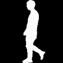

<div align="center"></div>


## You Can Run but not Hide:  Improving Gait Recognition with Intrinsic Occlusion Type Awareness

This [paper](https://github.com/Ayush-00/occ-aware-gait/blob/main/main_paper.pdf) has been accepted as a WACV 2024 Oral paper.

Our code is built on top of the OpenGait framework. Please follow the setup instructions of the framework to run our models.

The gaitgl_GREW_occ_aware.yaml and gaitpart_GREW_occ_aware.yaml config files contain the necessary settings to run the occlusion aware model. Please enter the file path for the preprocessed GREW dataset in the dataset_root parameter of the config file. Please enter the file path for the occlusion detector model in the occlusion_detector_path parameter. 

Project website: [link](https://ayush-00.github.io/occ-aware-website/)

### BibTeX Citation

If you find this work helpful in your research, please cite it using the following: 

```
@InProceedings{Gupta_2024_WACV,
    author    = {Gupta, Ayush and Chellappa, Rama},
    title     = {You Can Run but Not Hide: Improving Gait Recognition With Intrinsic Occlusion Type Awareness},
    booktitle = {Proceedings of the IEEE/CVF Winter Conference on Applications of Computer Vision (WACV)},
    month     = {January},
    year      = {2024},
    pages     = {5893-5902}
}
```


